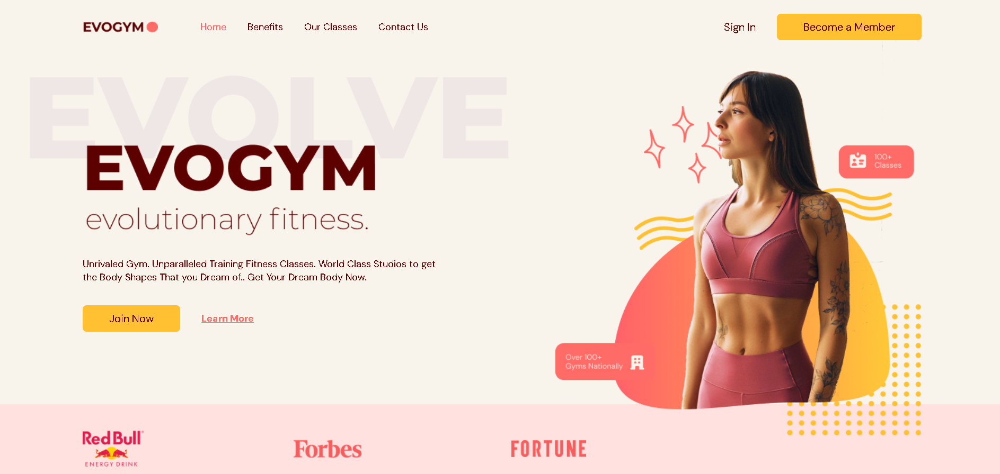

# Gym Website

A responsive and modern gym website built with React, TypeScript, and Vite.

---

## Demo

### Front Page Screenshot



### Demo Video

[Watch Demo Video](https://drive.google.com/file/d/1hfdlz1lKP4_KmSfZycBbTfslkbfGahCy/view?usp=sharing)

---

## Features

* **Responsive Design**: Optimized for desktop, tablet, and mobile devices.
* **User-Friendly Interface**: Easy navigation and accessible design.
* **Contact Form**: Includes form validation and submission handling.

---

## Tech Stack

* **React**: Front-end library for building user interfaces.
* **TypeScript**: Superset of JavaScript providing type safety.
* **Vite**: Fast development server and build tool.
* **CSS Modules with Tailwind CSS**: Component-level styling.
* **React Router**: Client-side routing for seamless navigation.

---

## Getting Started

### Prerequisites

* **Node.js** (>=14.17.0)
* **npm** (>=6.14.13)

### Installation

1. Clone the repository:
   ```bash
   git clone https://github.com/Rachit-31/Evogym.git
   cd Client
   npm install
   npm run dev

### Build

  ```bash
  npm run build
```
### Deployment


1.  Deploy the built files to your hosting platform of choice (e.g., Netlify, Vercel, GitHub Pages)
